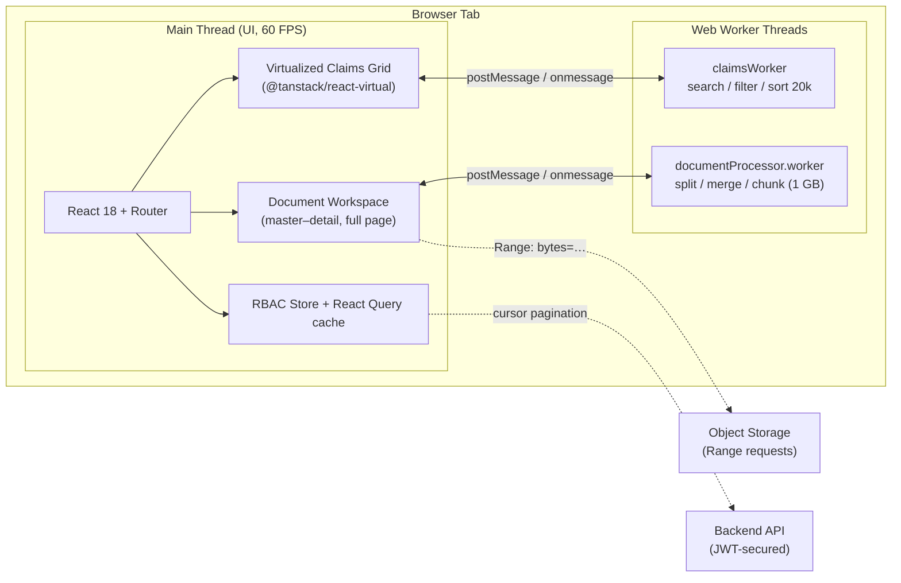
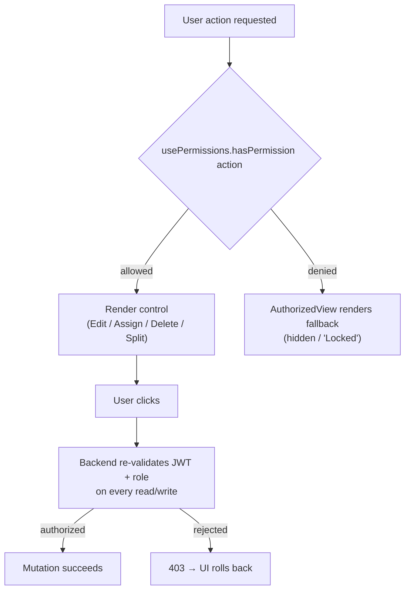
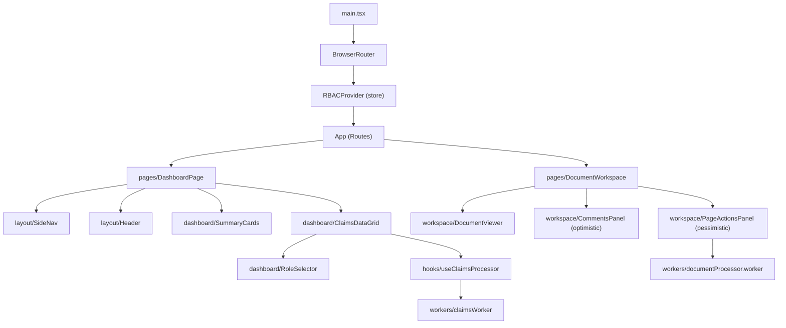
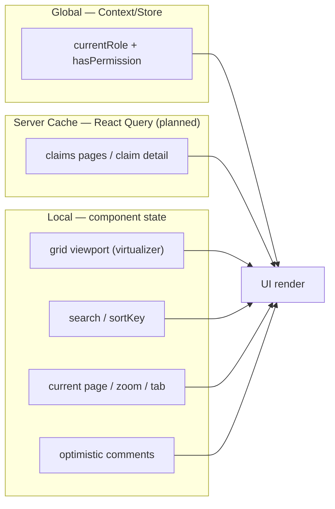
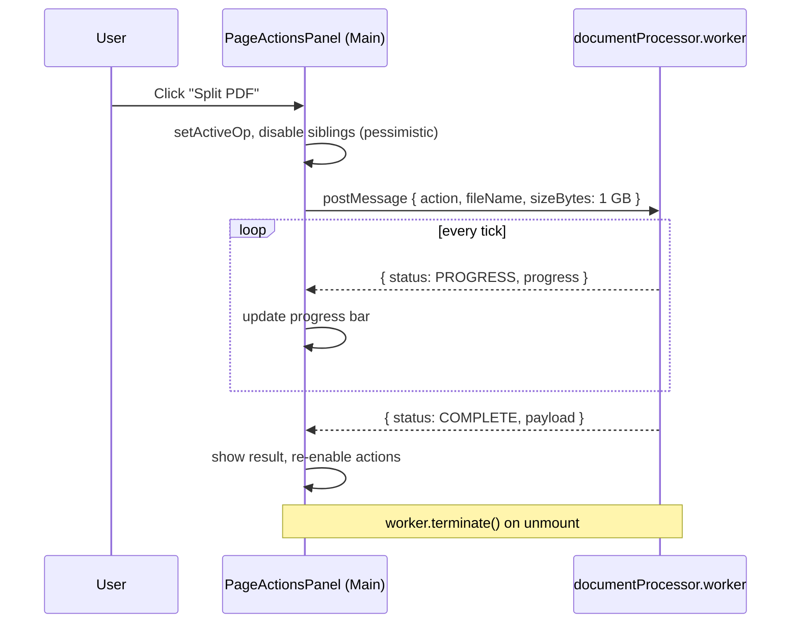

# Architecture Diagrams

Visual companions to the system design in [`../README.md`](../README.md). All
diagrams render natively on GitHub via Mermaid.

---

## 1. System Flow (High Level)

How a request travels from the user through the app shell to the two background
worker threads.

---

## 2. RBAC Decision Flow

Frontend masking is convenience only; the backend remains the source of truth.

---

## 3. Component Boundaries

---

## 4. State Ownership

---

## 5. Large Document Sequence (Split, 1 GB)

